# Casos de Uso — NEXORA

Diagramas de flujo funcionales con Mermaid para cada caso de uso principal de la plataforma.

---

## Índice

1. [Registro de Usuario (Email + OAuth)](#1-registro-de-usuario)
2. [Inicio de Sesión y Autenticación](#2-inicio-de-sesión)
3. [Recuperación de Contraseña](#3-recuperación-de-contraseña)
4. [Verificación de Email](#4-verificación-de-email)
5. [Autenticación de Dos Factores (2FA)](#5-autenticación-de-dos-factores)
6. [Creación y Publicación de Curso (Instructor)](#6-creación-y-publicación-de-curso)
7. [Inscripción a Curso (Pago o Gratuito)](#7-inscripción-a-curso)
8. [Reproducción de Lecciones y Tracking de Progreso](#8-reproducción-de-lecciones)
9. [Evaluación con Quizzes](#9-evaluación-con-quizzes)
10. [Pago de Curso con Stripe](#10-pago-de-curso-con-stripe)
11. [Suscripción (Plan Mensual/Anual)](#11-suscripción)
12. [Emisión de Certificado](#12-emisión-de-certificado)
13. [Reseñas y Calificaciones](#13-reseñas-y-calificaciones)
14. [Comentarios en Lecciones](#14-comentarios-en-lecciones)
15. [Notificaciones Push/In-App](#15-notificaciones)
16. [Notas y Bookmarks](#16-notas-y-bookmarks)
17. [Búsqueda de Cursos (Full-Text Search)](#17-búsqueda-de-cursos)
18. [Auditoría de Acciones](#18-auditoría-de-acciones)

---

## 1. Registro de Usuario

**Descripción**: Un nuevo usuario se registra en la plataforma, ya sea con email y contraseña o mediante OAuth (Google/GitHub).

**Actores**: Usuario no autenticado, Sistema

**Precondiciones**: El email no debe estar registrado previamente.

**Tablas involucradas**: `users`, `account`, `session`, `email_verification_logs`

### Flujo: Registro vía OAuth

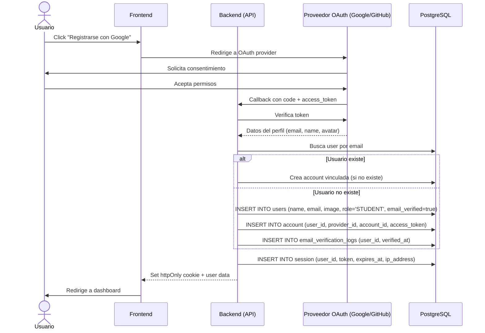

### Flujo: Registro vía Email/Password

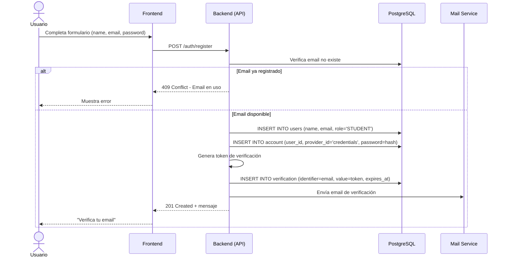

---

## 2. Inicio de Sesión

**Descripción**: Un usuario existente inicia sesión con email/password o mediante OAuth.

**Actores**: Usuario, Sistema

**Precondiciones**: La cuenta debe estar activa (`is_active = true`).

**Tablas involucradas**: `users`, `account`, `session`, `login_logs`

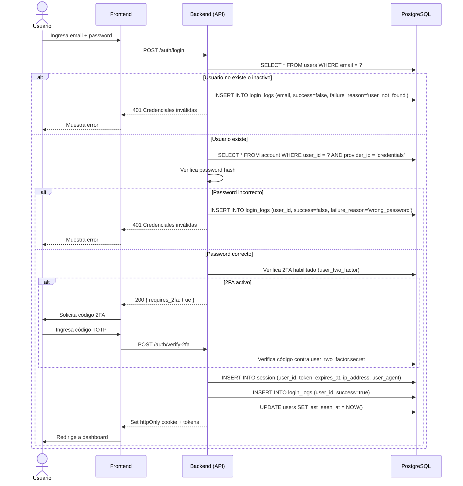

---

## 3. Recuperación de Contraseña

**Descripción**: Un usuario solicita restablecer su contraseña olvidada.

**Actores**: Usuario, Sistema

**Tablas involucradas**: `verification`, `password_reset_logs`, `account`

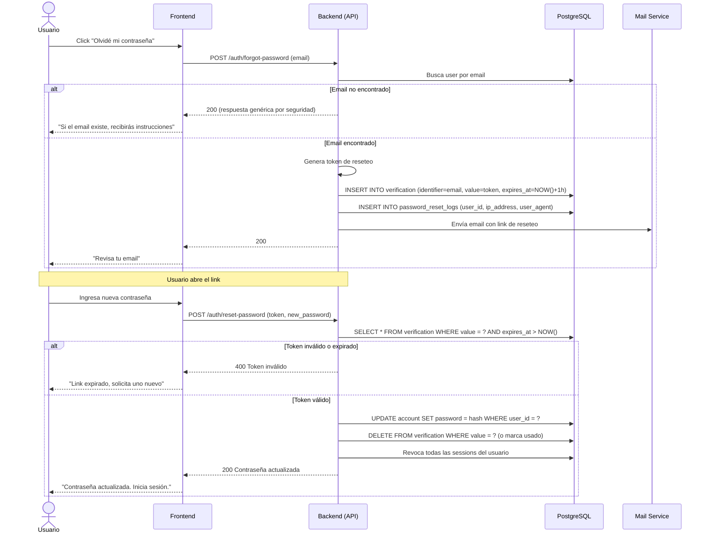

---

## 4. Verificación de Email

**Descripción**: Un usuario verifica su dirección de email después del registro.

**Actores**: Usuario, Sistema

**Tablas involucradas**: `verification`, `users`, `email_verification_logs`

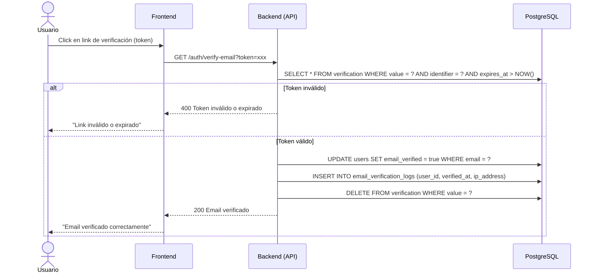

---

## 5. Autenticación de Dos Factores

**Descripción**: Un usuario habilita/deshabilita la verificación en dos pasos (2FA) con TOTP.

**Actores**: Usuario autenticado, Sistema

**Tablas involucradas**: `user_two_factor`

```mermaid
sequenceDiagram
    actor U as Usuario
    participant F as Frontend
    participant B as Backend (API)
    participant DB as PostgreSQL

    Note over U,B: Habilitar 2FA

    U->>F: Configuración → "Activar 2FA"
    F->>B: POST /auth/2fa/enable
    B->>B: Genera secreto TOTP + QR
    B-->>F: 200 { secret, qr_code_url, backup_codes[] }
    F->>U: Muestra QR + backup codes
    U->>F: Escanea QR con Google Auth / Authy
    U->>F: Ingresa código 2FA de confirmación
    F->>B: POST /auth/2fa/verify (code)
    B->>B: Verifica código contra el secreto
    alt Código incorrecto
        B-->>F: 400 Código inválido
    else Código correcto
        B->>DB: INSERT INTO user_two_factor (user_id, secret, backup_codes, is_enabled=true)
        B-->>F: 200 2FA activado
        F-->>U: "2FA activado correctamente"
    end

    Note over U,B: Deshabilitar 2FA

    U->>F: Configuración → "Desactivar 2FA"
    F->>B: POST /auth/2fa/disable (password)
    B->>DB: Verifica password
    alt Password incorrecto
        B-->>F: 401 Password inválido
    else Password correcto
        B->>DB: UPDATE user_two_factor SET is_enabled=false WHERE user_id = ?
        -->>B: O DELETE FROM user_two_factor WHERE user_id = ?
        B-->>F: 200 2FA desactivado
    end
```

---

## 6. Creación y Publicación de Curso

**Descripción**: Un instructor crea un curso, agrega módulos y lecciones, y lo publica.

**Actores**: Instructor, Sistema

**Precondiciones**: El usuario debe tener rol `INSTRUCTOR` o `ADMIN`.

**Tablas involucradas**: `courses`, `modules`, `lessons`, `categories`, `course_tags`, `tags`

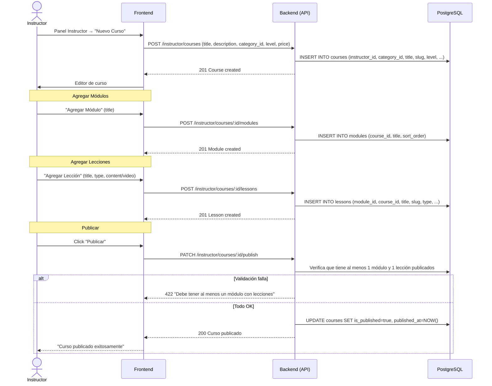

---

## 7. Inscripción a Curso

**Descripción**: Un estudiante se inscribe en un curso. Si es gratuito, se inscribe directamente. Si es pago, requiere completar el pago primero.

**Actores**: Estudiante, Sistema

**Precondiciones**: El curso debe estar publicado (`is_published = true`). El estudiante no debe estar ya inscrito.

**Tablas involucradas**: `enrollments`, `payments`, `courses`

### Flujo: Curso gratuito

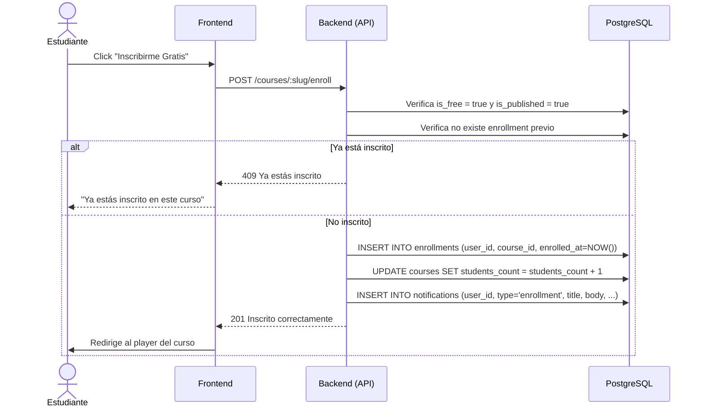

### Flujo: Curso pago (con Stripe)

> Ver [Caso de Uso #10 — Pago de Curso con Stripe](#10-pago-de-curso-con-stripe)

---

## 8. Reproducción de Lecciones

**Descripción**: Un estudiante inscrito reproduce lecciones, y el sistema trackea el progreso automáticamente.

**Actores**: Estudiante, Sistema

**Precondiciones**: El estudiante debe estar inscrito (`enrollments` existe).

**Tablas involucradas**: `lesson_progress`, `enrollments`, `lessons`, `modules`

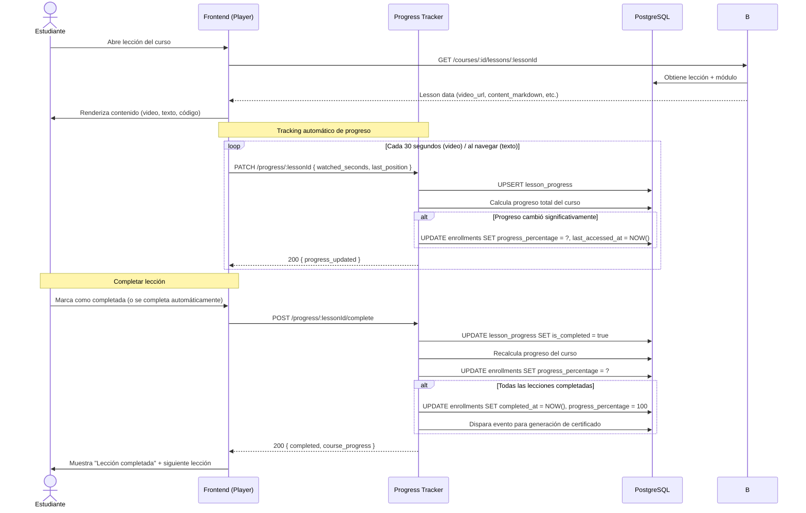

---

## 9. Evaluación con Quizzes

**Descripción**: Un estudiante realiza un quiz asociado a una lección. El sistema evalúa las respuestas automáticamente y registra el resultado.

**Actores**: Estudiante, Sistema

**Precondiciones**: El estudiante debe estar inscrito en el curso.

**Tablas involucradas**: `quizzes`, `quiz_questions`, `quiz_options`, `quiz_attempts`, `quiz_attempt_answers`

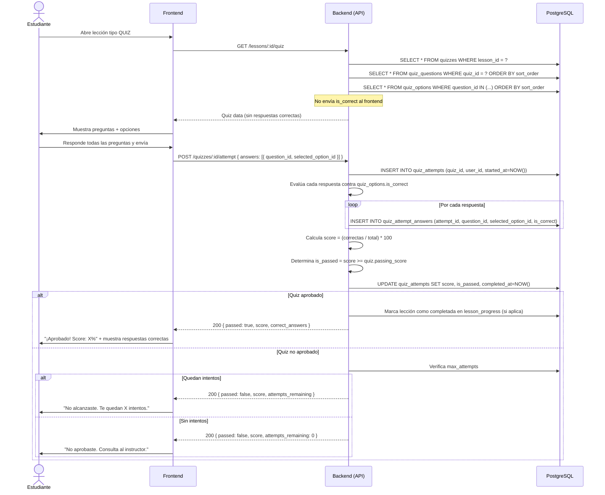

---

## 10. Pago de Curso con Stripe

**Descripción**: Un estudiante compra un curso de pago usando Stripe como gateway de pagos.

**Actores**: Estudiante, Sistema, Stripe

**Precondiciones**: El curso debe tener precio > 0. El estudiante no debe estar ya inscrito.

**Tablas involucradas**: `payments`, `enrollments`, `courses`

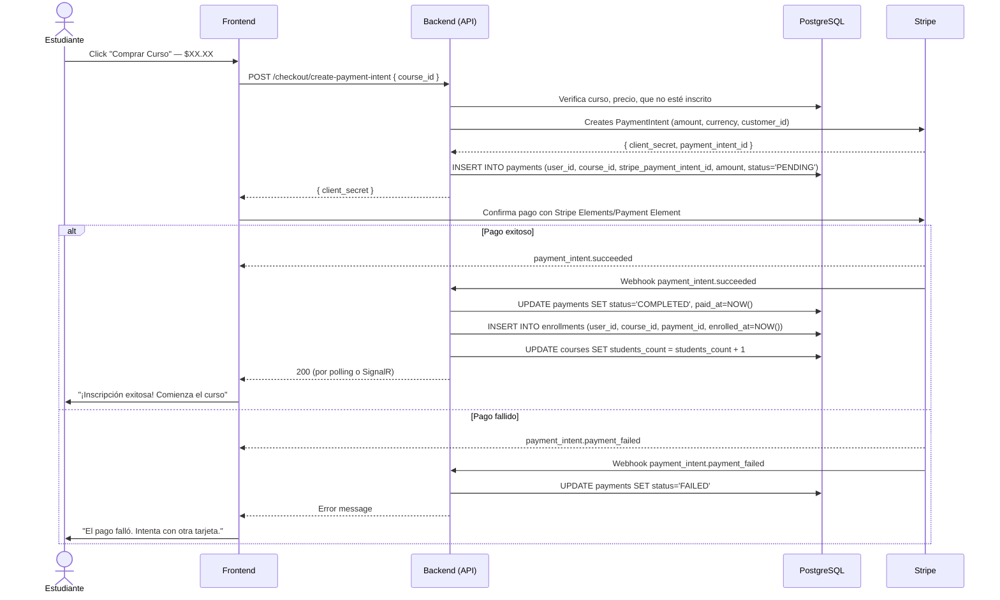

---

## 11. Suscripción

**Descripción**: Un usuario se suscribe a un plan (mensual/anual/lifetime) para acceder a contenido premium.

**Actores**: Usuario, Sistema, Stripe

**Tablas involucradas**: `subscriptions`, `payments`

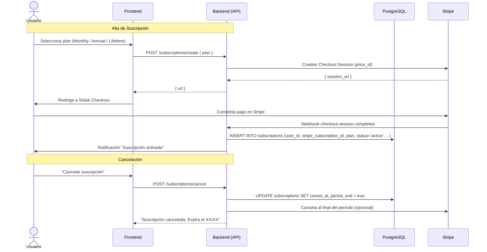

---

## 12. Emisión de Certificado

**Descripción**: Cuando un estudiante completa todas las lecciones de un curso, el sistema genera automáticamente un certificado en PDF.

**Actores**: Sistema, Estudiante

**Precondiciones**: El enrollment debe tener `completed_at` con valor o `progress_percentage = 100`.

**Tablas involucradas**: `certificates`, `enrollments`, `courses`, `users`

```mermaid
sequenceDiagram
    participant P as Progress Tracker
    participant B as Backend (API)
    participant DB as PostgreSQL
    participant G as PDF Generator (QuestPDF)

    Note over P: Evento: curso completado
    P->>B: Dispara evento CourseCompleted (user_id, course_id, enrollment_id)
    B->>DB: Verifica que no exista certificado previo
    alt Certificado ya existe
        B-->>P: Skip
    else No existe
        B->>B: Genera certificate_number (formato: NXR-2025-XXXXX)
        B->>G: Genera PDF con datos del estudiante y curso
        G-->>B: PDF generado, subido a storage
        B->>DB: INSERT INTO certificates (user_id, course_id, enrollment_id, certificate_number, pdf_url, issued_at, verification_url)
        B->>DB: INSERT INTO notifications (user_id, type='certificate', ...)
    end

    Note over E: El estudiante recibe notificación

    actor E as Estudiante
    E->>F: Abre notificación de certificado
    F->>B: GET /certificates/:id
    B-->>F: Certificate data + pdf_url
    F->>E: Muestra certificado con opción de descargar

    Note over E,F: Verificar certificado

    V as Visitante
    V->>F: Ingresa a /certificados/verificar?code=NXR-2025-XXXXX
    F->>B: GET /certificates/verify?code=xxx
    B->>DB: Busca por certificate_number
    alt Válido
        B-->>F: { valid: true, user_name, course_title, issued_at }
        F->>V: Muestra certificado verificado
    else Inválido
        B-->>F: { valid: false }
        F->>V: "Certificado no encontrado"
    end
```

---

## 13. Reseñas y Calificaciones

**Descripción**: Un estudiante puede calificar y reseñar un curso en el que está inscrito.

**Actores**: Estudiante, Sistema

**Precondiciones**: El estudiante debe estar inscrito. Solo una reseña por curso.

**Tablas involucradas**: `reviews`, `courses`

```mermaid
sequenceDiagram
    actor E as Estudiante
    participant F as Frontend
    participant B as Backend (API)
    participant DB as PostgreSQL

    E->>F: Navega a página del curso completado
    E->>F: Selecciona rating (1-5) + escribe reseña
    F->>B: POST /courses/:slug/reviews { rating, title, body }
    B->>DB: Verifica que existe enrollment y no hay review previa
    alt Ya reseñó
        B-->>F: 409 "Ya calificaste este curso"
    else Es su primera reseña
        B->>DB: INSERT INTO reviews (user_id, course_id, rating, title, body)
        B->>DB: Recalcula average_rating y reviews_count en courses
        Note over B: UPDATE courses SET average_rating = (SELECT AVG(rating) FROM reviews WHERE course_id = ?), reviews_count = (SELECT COUNT(*) FROM reviews WHERE course_id = ?)
        B-->>F: 201 Review created
        F->>E: "Reseña publicada"
    end

    Note over E,F: Marcar reseña como útil

    Otro as OtroEstudiante
    Otro->>F: Click "Me sirvió" en una reseña
    F->>B: POST /reviews/:id/helpful
    B->>DB: UPDATE reviews SET helpful_count = helpful_count + 1
    B-->>F: 200
```

---

## 14. Comentarios en Lecciones

**Descripción**: Los estudiantes pueden comentar en las lecciones y responder a otros comentarios (hilos).

**Actores**: Estudiante, Instructor, Sistema

**Tablas involucradas**: `comments`, `notifications`

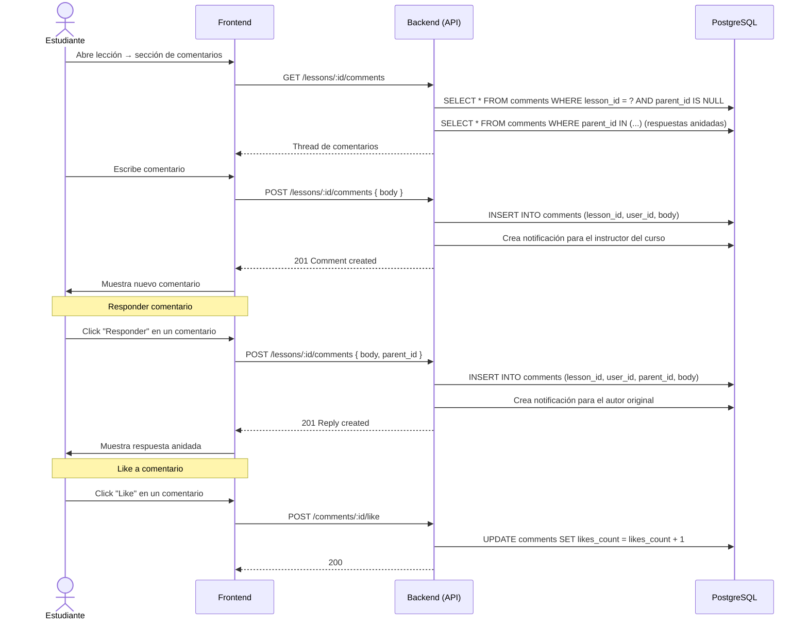

---

## 15. Notificaciones

**Descripción**: El sistema envía notificaciones a los usuarios por distintos eventos (inscripción, certificado, comentarios, etc.).

**Actores**: Sistema, Usuario

**Tablas involucradas**: `notifications`

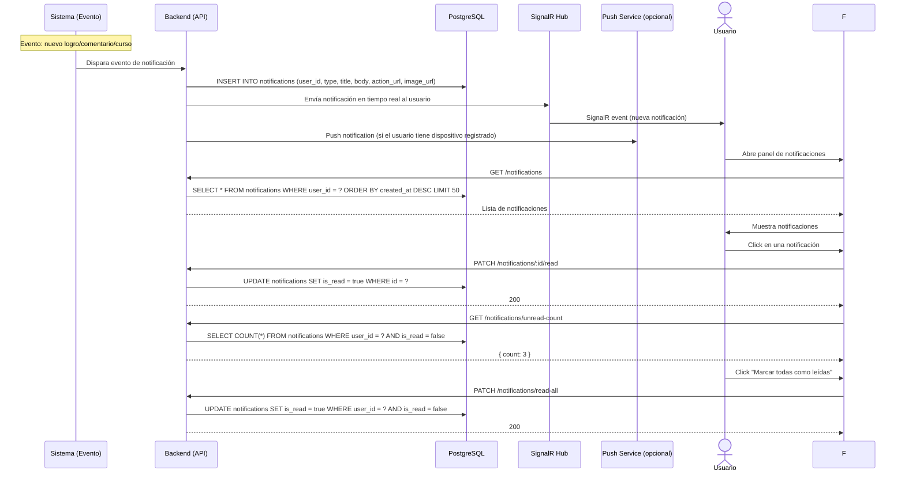

---

## 16. Notas y Bookmarks

**Descripción**: Los estudiantes pueden tomar notas en las lecciones y guardar cursos como favoritos.

**Actores**: Estudiante, Sistema

**Tablas involucradas**: `lesson_notes`, `bookmarks`

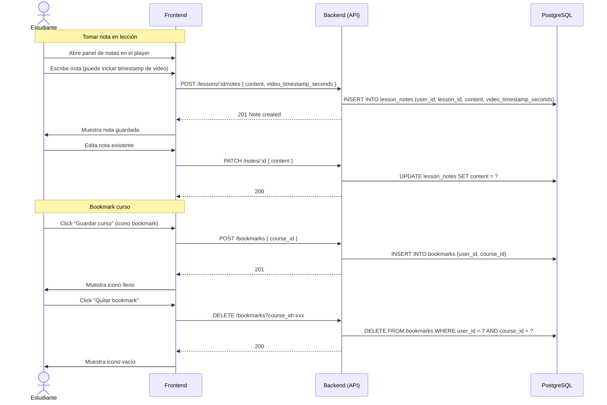

---

## 17. Búsqueda de Cursos

**Descripción**: Los usuarios buscan cursos utilizando full-text search sobre el título, descripción y objetivos.

**Actores**: Visitante/Usuario, Sistema

**Tablas involucradas**: `courses` (con índice GIN en `search_vector`)

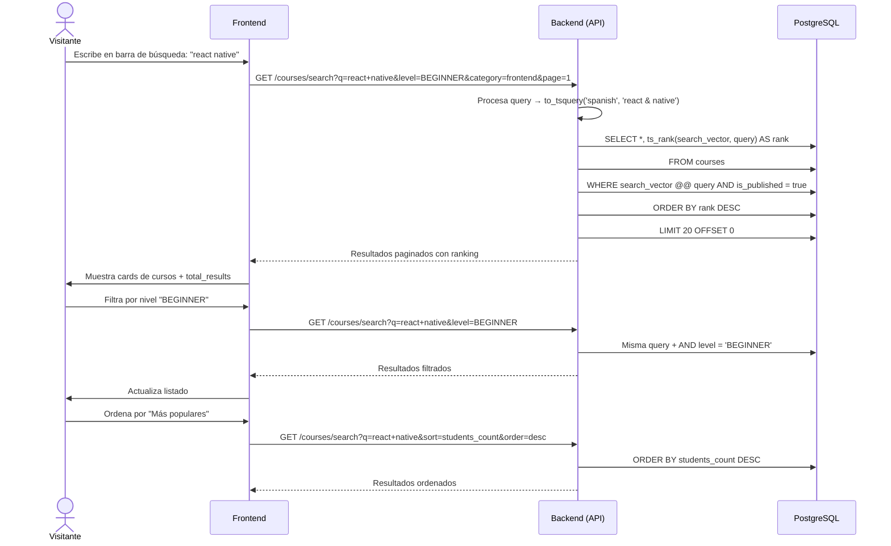

---

## 18. Auditoría de Acciones

**Descripción**: El sistema registra automáticamente acciones importantes realizadas por los usuarios para cumplimiento y debugging.

**Actores**: Sistema (automático), Admin (consulta)

**Tablas involucradas**: `audit_logs`

```mermaid
sequenceDiagram
    participant U as Usuario (Admin/Instructor)
    participant B as Backend (API)
    participant DB as PostgreSQL
    participant A as Audit Logger
    participant S as Storage

    Note over U,A: Registro automático

    U->>B: Realiza acción sensible (delete course, change role, refund)
    B->>A: Emite evento AuditEntry { user_id, action, entity_type, entity_id, old_values, new_values, ip_address }
    A->>DB: INSERT INTO audit_logs (user_id, action, entity_type, entity_id, old_values, new_values, ip_address)
    A-->>B: Log registrado
    B-->>U: Acción completada

    Note over A,S: Consulta de auditoría

    Admin as Administrador
    Admin->>F: Panel Admin → "Auditoría"
    F->>B: GET /admin/audit-logs?entity_type=courses&action=delete&from_date=2025-01-01
    B->>DB: SELECT * FROM audit_logs WHERE entity_type = 'courses' AND action = 'delete' AND created_at >= '2025-01-01' ORDER BY created_at DESC
    B-->>F: Lista paginada de logs
    F->>Admin: Muestra tabla con usuario, acción, fecha, cambios

    Admin->>F: Click en un log específico
    F->>B: GET /admin/audit-logs/:id
    B->>DB: SELECT * FROM audit_logs WHERE id = ?
    B-->>F: Detalle completo (old_values, new_values en JSON)
    F->>Admin: Muestra diff de cambios
```

---

## Resumen de Tablas por Caso de Uso

| Caso de Uso | Tablas Principales |
|-------------|-------------------|
| Registro | `users`, `account`, `session`, `verification`, `email_verification_logs` |
| Login | `users`, `account`, `session`, `user_two_factor`, `login_logs` |
| Recuperar Password | `verification`, `password_reset_logs`, `account` |
| Verificar Email | `verification`, `users`, `email_verification_logs` |
| 2FA | `user_two_factor` |
| Gestión de Cursos | `courses`, `modules`, `lessons`, `categories`, `course_tags`, `tags` |
| Inscripción | `enrollments`, `payments`, `courses` |
| Lecciones/Progreso | `lesson_progress`, `enrollments`, `lessons` |
| Quizzes | `quizzes`, `quiz_questions`, `quiz_options`, `quiz_attempts`, `quiz_attempt_answers` |
| Pagos | `payments`, `enrollments`, `courses` |
| Suscripciones | `subscriptions`, `payments` |
| Certificados | `certificates`, `enrollments`, `courses`, `users` |
| Reseñas | `reviews`, `courses` |
| Comentarios | `comments`, `notifications` |
| Notificaciones | `notifications` |
| Notas/Bookmarks | `lesson_notes`, `bookmarks` |
| Búsqueda | `courses` (GIN index en `search_vector`) |
| Auditoría | `audit_logs` |
